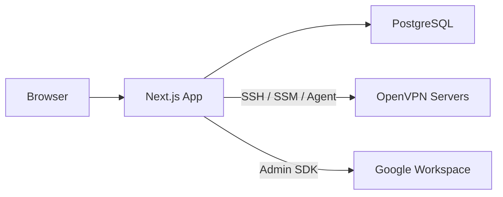
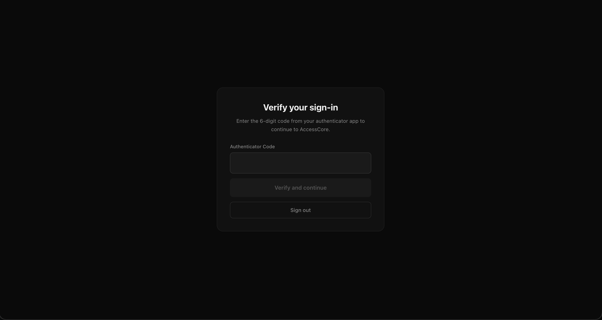

# AccessCore

AccessCore is a self-service VPN access and operations portal for OpenVPN. It brings user onboarding, approvals, certificate lifecycle, access policy, audit trails, and server operations into one focused interface.


## What AccessCore Covers

- **Self-service access** - Access requests, approval workflow, viewer/admin roles, and profile security
- **VPN user lifecycle** - User creation, certificate generation, revocation, import, and deletion
- **Policy and routing** - Access groups, CIDR-based routing, CCD generation, sync, and drift detection
- **Operational visibility** - Audit log, analytics, sync history, flags, and live server operations
- **Identity integration** - Credentials, Google OAuth, generic OIDC SSO, optional LDAP, and TOTP MFA
- **Infrastructure control** - Multi-server support over SSH, AWS SSM, or the AccessCore agent

## Tech Stack

| Layer | Technology |
|-------|-----------|
| Frontend | Next.js 16, React 19, Tailwind CSS 4 |
| Backend | Next.js API Routes, TypeScript |
| Database | PostgreSQL 16, Prisma ORM |
| Auth | NextAuth.js (Credentials, Google OAuth, generic OIDC SSO, optional LDAP) |
| Server Transport | SSH (ssh2), AWS SSM, Custom Agent |
| Integration | Google Admin SDK |
| Testing | Vitest |

## Why AccessCore

- It keeps VPN onboarding and access review in one place instead of splitting them across scripts, spreadsheets, and server-only tooling.
- It supports both self-service user flows and hands-on operational controls for administrators.
- It works with real OpenVPN server management patterns like CCD sync, certificate lifecycle, and route drift reconciliation.
- It is designed to sit cleanly in front of existing identity systems rather than replacing them.

## Architecture



See [docs/diagrams/](./docs/diagrams/) for detailed architecture, auth flow, data flow, network security, API routes, and database schema diagrams.

## Quick Start

```bash
# Install dependencies
npm install

# Create environment file
cp .env.example .env

# Start PostgreSQL and OpenVPN (Docker)
npm run docker:up

# Create an initial admin account for local setup
export SEED_ADMIN_EMAIL="admin@local.test"
export SEED_ADMIN_PASSWORD="change-this-demo-password"

# Run database migrations and seed
npm run db:migrate
npm run db:seed

# Start dev server
npm run dev
```

Open [http://localhost:3000](http://localhost:3000) and sign in with the admin account you seeded locally.

See [docs/getting-started.md](./docs/getting-started.md) for full installation, local setup, and deployment guidance.

Docker assets live under [`docker/`](./docker/), including the local Compose stack and production image build file.

## Documentation

| Document | Description |
|----------|------------|
| [Getting Started](./docs/getting-started.md) | Installation, local development, and deployment guide |
| [System Architecture](./docs/diagrams/system-architecture.md) | Component diagram and service responsibilities |
| [Auth Flow](./docs/diagrams/auth-flow.md) | Authentication, sessions, and RBAC |
| [Data Flow](./docs/diagrams/data-flow.md) | User lifecycle, sync, certs, CCD push |
| [Network Security](./docs/diagrams/network-security.md) | Production topology, security boundaries, threat model |
| [API Routes](./docs/diagrams/api-routes.md) | All endpoints by access level |
| [Database Schema](./docs/diagrams/database-schema.md) | Entity relationship diagram |
| [AWS Deployment](./docs/aws-secure-deployment.md) | Production AWS architecture with ALB + Google OIDC |

## Local Development

- `npm run docker:up` starts PostgreSQL, OpenVPN, and the local stack
- `npm run docker:logs -- openvpn` tails the local OpenVPN service logs
- `npm run db:migrate` applies local schema changes
- `npm run db:seed` creates demo infrastructure data and an optional initial admin
- `npm test` runs the current automated test suite

## Project Structure

```
src/
├── app/
│   ├── (dashboard)/     # Protected dashboard pages
│   ├── api/             # REST API routes
│   ├── login/           # Login page
│   └── request-access/  # Self-service access request
├── components/          # React components (layout, UI)
└── lib/                 # Core services
    ├── transport/       # SSH, SSM, Agent transports
    ├── auth.ts          # NextAuth configuration
    ├── rbac.ts          # Role-based access control
    ├── cert-service.ts  # Certificate management
    ├── ccd-generator.ts # CCD file generation
    ├── sync-engine.ts   # Google Workspace sync
    └── import-service.ts # User discovery & import
```

## Screenshots

| View | Preview |
|------|---------|
| Login |  |
| Dashboard |  |
| Groups |  |
| Group Management |  |
| MFA |  |

See [docs/screenshots/README.md](./docs/screenshots/README.md) for the screenshot asset index.

## License

MIT. See [LICENSE](./LICENSE).
