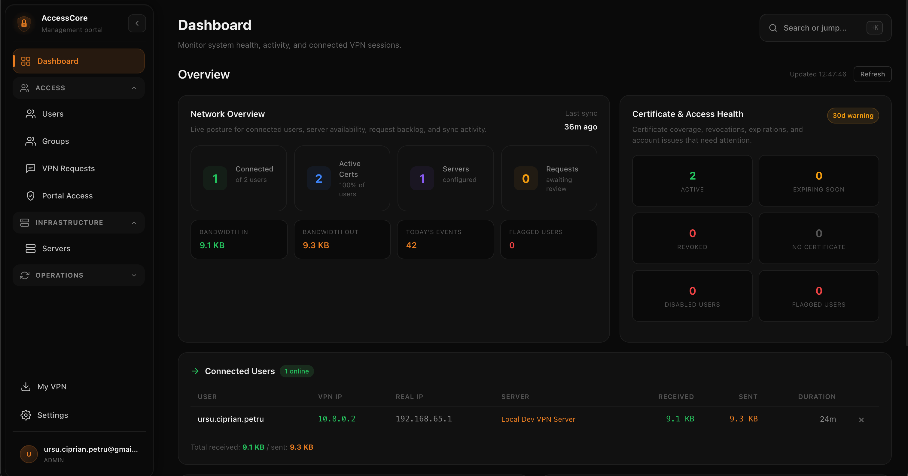
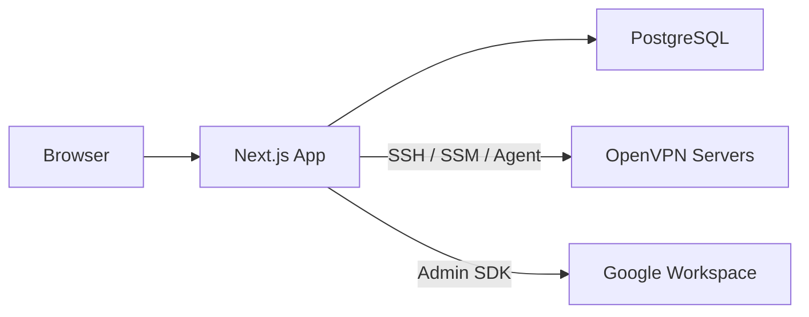
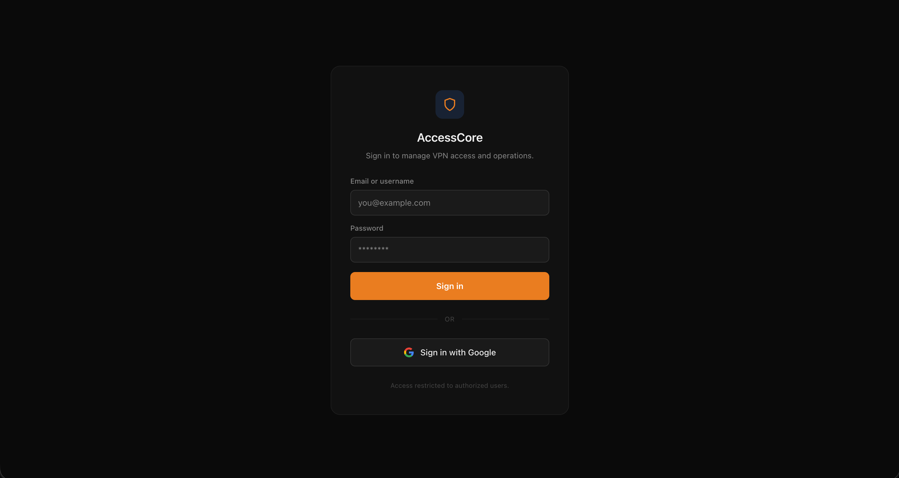
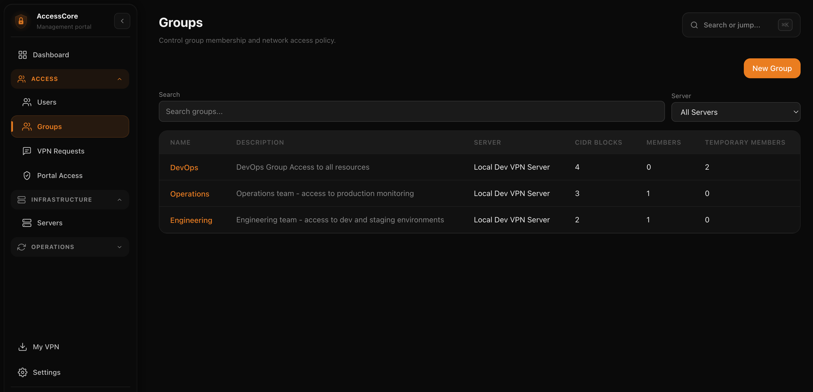
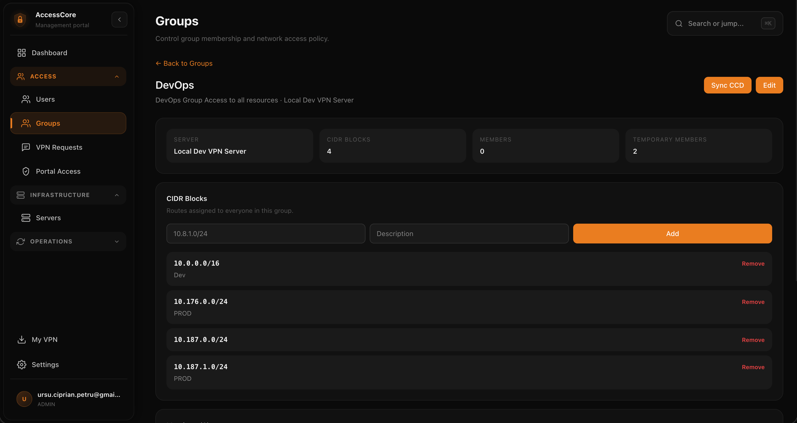
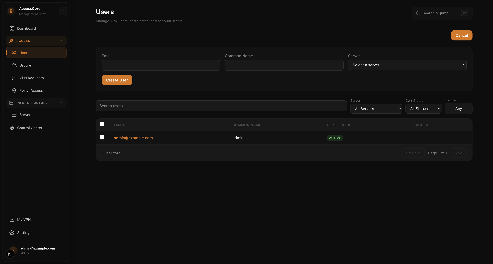
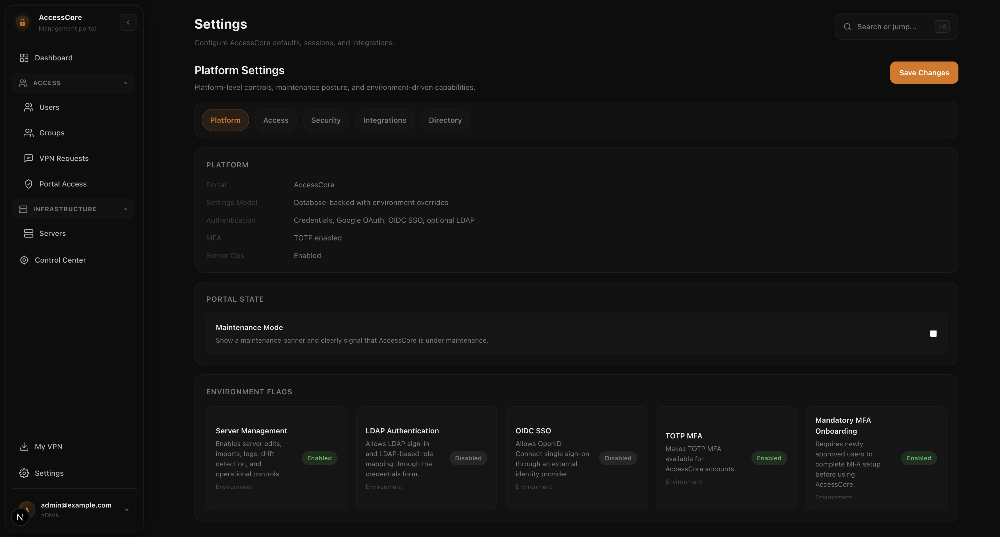

# AccessCore

AccessCore is an OpenVPN access control plane for teams.

It gives you a single place to request access, approve users, issue and revoke client certificates, manage CCD-based routing, deliver VPN profiles, and audit what changed.



## What It Is

AccessCore sits between your identity system, your administrators, and your OpenVPN servers.

It is built for teams that still run OpenVPN and want something better than:

- manual certificate scripts
- spreadsheets for access review
- ad hoc CCD updates on servers
- scattered onboarding docs
- weak audit visibility

## Best For

- internal IT and platform teams managing OpenVPN access
- environments with approval workflows, MFA, and audit requirements
- teams that need group-based routing and CCD sync
- organizations that want Google, OIDC, or LDAP-backed sign-in in front of OpenVPN operations

## Not For

- WireGuard environments
- mesh VPN products like Tailscale or ZeroTier
- teams looking for a generic ZTNA platform today
- one-off personal VPN setups

## Core Workflows

1. Request and approve access.
Users request VPN access, reviewers approve it, and the user gets a clean `My VPN` path to download the right profile.

2. Manage certificate lifecycle.
Admins can generate, revoke, and regenerate client certificates without dropping into server-only tooling.

3. Control routing and CCD delivery.
Groups, CIDR policies, CCD sync, and drift checks stay visible in the same portal.

4. Audit access and operations.
MFA, access changes, provisioning, downloads, and server operations are logged and reviewable.

## Feature Overview

| Area | Included |
|---|---|
| Access workflows | Access requests, approval queue, viewer/admin roles, pending approval states |
| Identity | Credentials, Google OAuth, generic OIDC SSO, optional LDAP |
| Security | TOTP MFA, server-side session revocation, audit trails |
| VPN lifecycle | User creation, certificate generation, revocation, regeneration, deletion |
| Policy | Groups, CIDR-based routing, CCD generation, push, drift detection |
| Operations | Dashboard, analytics, flags, sync history, live server actions |
| Transport | SSH, AWS SSM, AccessCore agent |

## Why It’s Different

- It is focused on OpenVPN instead of trying to be a generic networking platform.
- It combines end-user access flows and operator tooling in one product.
- It treats certificate lifecycle, CCD state, and approval workflows as first-class product concepts.
- It is designed to work with existing identity systems instead of replacing them.

## Status

AccessCore is in active development.

Today, it is best described as:

- production-minded
- OpenVPN-only
- suitable for self-hosted evaluation and internal use
- still maturing as a public open-source product

## Architecture



See [Docs Index](./docs/README.md) for detailed diagrams and deployment guides.

## Quick Start

```bash
npm install
cp .env.example .env
npm run docker:up

export SEED_ADMIN_EMAIL="admin@local.test"
export SEED_ADMIN_PASSWORD="change-this-demo-password"

npm run db:migrate
npm run db:seed
npm run dev
```

Open [http://localhost:3000](http://localhost:3000) and sign in with the seeded admin account.

## Screenshots

| Workflow | Preview |
|---|---|
| Login |  |
| Dashboard |  |
| Groups |  |
| Group Management |  |
| User Creation |  |
| Settings |  |

## Documentation

| Document | Purpose |
|---|---|
| [Getting Started](./docs/getting-started.md) | Local setup, configuration, deployment basics |
| [Docs Index](./docs/README.md) | Diagrams, guides, screenshots, security docs |
| [Roadmap](./ROADMAP.md) | Product direction, positioning, naming, OSS maturity plan |
| [Security Policy](./SECURITY.md) | How to report vulnerabilities |

## Project Structure

```text
src/
├── app/
│   ├── (dashboard)/      # Protected app pages
│   ├── api/              # API routes
│   ├── login/            # Login and sign-in
│   ├── mfa/              # MFA setup and verification
│   └── request-access/   # Self-service access request flow
├── components/           # Layout and UI components
└── lib/                  # Auth, RBAC, transport, cert, CCD, sync services
```

## Open Source Readiness

The repository already includes:

- [MIT license](./LICENSE)
- [contribution guide](./CONTRIBUTING.md)
- [security policy](./SECURITY.md)
- CI for lint, typecheck, test, and build

## License

MIT. See [LICENSE](./LICENSE).
