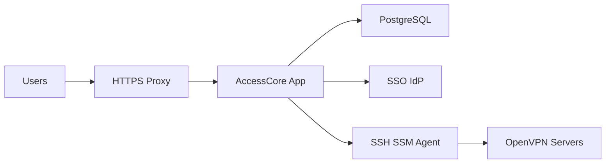

# AccessCore Threat Model

## Executive summary

AccessCore is a single-tenant, internet-reachable OpenVPN access control plane with SSO, MFA, certificate lifecycle, VPN config delivery, and privileged server-management capabilities. The top risk themes are broken access control on custom API routes, session or CSRF abuse against cookie-authenticated state-changing actions, and compromise of the server-management plane that can issue/revoke certificates or modify OpenVPN state on managed servers. The highest-risk review areas are auth/session enforcement, privileged API routes, and SSH/SSM/agent-backed remote command execution.

## Scope and assumptions

- In scope: the Next.js application runtime, API routes, auth/session handling, Prisma/PostgreSQL data layer, transport-to-server management plane, and OpenVPN config/certificate delivery paths under `src/app`, `src/lib`, `prisma`, and `next.config.js`.
- Out of scope: CI pipeline hardening, local developer workstation security, Docker host hardening, and external IdP internals.
- Intended usage: public internet plus SSO, single tenant, one organization.
- Deployment assumption: production traffic is terminated over HTTPS at a reverse proxy / ALB before reaching the app, consistent with `docs/aws-secure-deployment.md`.
- Auth assumption: users authenticate via credentials, Google, or generic OIDC; admins perform privileged certificate, CCD, and server operations. Session state is cookie-backed via NextAuth JWT sessions in `src/lib/auth.ts`.
- Open question that would change ranking: whether the app is always behind an identity-aware proxy in production or sometimes exposed directly to the internet.

## System model

### Primary components

- Browser client: Next.js App Router pages under `src/app/(dashboard)`, login/MFA flows under `src/app/login` and `src/app/mfa`.
- Application server: Next.js route handlers under `src/app/api`, session and auth logic in `src/lib/auth.ts`, authorization wrappers in `src/lib/rbac.ts`, and middleware enforcement in `src/middleware.ts`.
- Database: PostgreSQL via Prisma models and queries across route handlers and services.
- Identity providers: Google OAuth and generic OIDC configured in `src/lib/auth.ts`; optional LDAP also exists there.
- Server management plane: SSH, AWS SSM, or AccessCore agent transports in `src/lib/transport/index.ts`.
- OpenVPN servers: managed indirectly through certificate issuance, revocation, CCD delivery, config reads, and status/log calls.

### Data flows and trust boundaries

- Internet user -> Reverse proxy / ALB -> Next.js app
  - Data: credentials, OAuth redirects, cookies, MFA codes, admin actions.
  - Channel: HTTPS externally, HTTP or private network hop internally by deployment assumption.
  - Security guarantees: CSP/HSTS/header policy in `next.config.js`; auth middleware in `src/middleware.ts`; TLS expected in `docs/aws-secure-deployment.md`.
  - Validation: route-specific Zod validation in many mutating routes; session checks via `requireAdmin`, `requireApprovedUser`, and `withAuth`.

- Browser -> Auth/session subsystem
  - Data: credentials, OAuth callbacks, session cookies, MFA verification.
  - Channel: HTTP(S) to `/api/auth/*` and `/api/auth/mfa/verify`.
  - Security guarantees: NextAuth session callbacks and JWT/session shaping in `src/lib/auth.ts`; MFA verification cookie signing in `src/lib/mfa-cookie.ts`; session validation endpoint in `src/app/api/auth/validate-session/route.ts`.
  - Validation: provider/domain checks in `src/lib/auth.ts`; MFA code regex and rate limits in `src/app/api/auth/mfa/verify/route.ts`.

- Next.js app -> PostgreSQL
  - Data: users, approvals, sessions, audit logs, access requests, server definitions, VPN state metadata.
  - Channel: Prisma to PostgreSQL.
  - Security guarantees: application-layer authz before most access; no database row-level security evidenced in repo.
  - Validation: Zod and route/business logic; integrity depends heavily on route-level authorization.

- Next.js app -> Identity providers
  - Data: OAuth/OIDC identity assertions and LDAP auth requests.
  - Channel: HTTPS to Google/OIDC; LDAP network transport depending on environment.
  - Security guarantees: allowed-domain enforcement and verified-email checks in `src/lib/auth.ts`.
  - Validation: domain and issuer/profile checks are implemented in auth callback logic.

- Next.js app -> OpenVPN management plane
  - Data: certificate commands, CCD writes, server config reads, session termination, logs/status queries.
  - Channel: SSH, SSM, or HTTPS agent depending on server transport in `src/lib/transport/index.ts`.
  - Security guarantees: per-server transport config and agent URL validation; command-input validation and shell escaping are partially centralized in services such as `src/lib/cert-service.ts` and `src/lib/shell.ts`.
  - Validation: common-name and server-path validation in cert/config services; risk depends on complete coverage across all command-building routes.

#### Diagram

## Assets and security objectives

| Asset | Why it matters | Security objective (C/I/A) |
|---|---|---|
| Admin accounts and sessions | Admins can approve access, issue/revoke certificates, push CCD, and operate servers | C/I |
| User sessions and MFA state | Session theft or MFA bypass grants portal access and potentially VPN config access | C/I |
| VPN configs and private keys | `.ovpn` downloads include private key material and enable network access | C/I |
| Certificate lifecycle state | Wrong issuance/revocation breaks access control and trust in VPN identity | I/A |
| CCD and routing policy | Incorrect routes can overexpose internal networks or break user connectivity | I/A |
| Server transport credentials | SSH keys, SSM access, or agent keys enable privileged remote operations | C/I |
| Access request and approval state | Governs who gets approved, provisioned, and which groups/routes they receive | I |
| Audit logs | Needed for investigations, admin accountability, and compliance-style review | I/A |

## Attacker model

### Capabilities

- Remote internet attacker can reach the public app entrypoint and attempt auth abuse, CSRF, session theft, or direct API interaction.
- Authenticated low-privilege user can interact with approved-user routes and attempt broken access control against other users’ configs or records.
- Compromised admin browser session can invoke high-impact certificate, CCD, and bulk operations.
- Malicious or compromised upstream configuration/operator input could influence server transport definitions and management actions.

### Non-capabilities

- Not assuming the attacker already has shell access on the app host, database host, or OpenVPN servers.
- Not assuming compromise of Google/OIDC providers themselves.
- Not assuming a multi-tenant cross-customer threat model, since this is single-tenant.

## Entry points and attack surfaces

| Surface | How reached | Trust boundary | Notes | Evidence (repo path / symbol) |
|---|---|---|---|---|
| Login / SSO / session issuance | Browser to `/login` and `/api/auth/*` | Internet -> App | Credentials, OAuth, session creation | `src/app/login/page.tsx`, `src/app/api/auth/[...nextauth]/route.ts`, `src/lib/auth.ts` |
| MFA verification | Browser to `/mfa/verify` and `/api/auth/mfa/verify` | Internet -> App | TOTP verification and MFA cookie issuance | `src/app/mfa/verify/page.tsx`, `src/app/api/auth/mfa/verify/route.ts`, `src/lib/mfa-cookie.ts` |
| Custom mutating APIs | Browser to `/api/*` POST/PUT/PATCH/DELETE | Internet -> App | Many custom routes rely on cookie auth and route-level authz; no generic CSRF/origin guard evidenced | `src/app/api/**`, `src/lib/rbac.ts` |
| Access approval/provisioning | Admin to `/api/access-requests/[id]` | Authenticated admin -> App -> DB -> Server mgmt | Creates users, groups, certs, approval state | `src/app/api/access-requests/[id]/route.ts` |
| Certificate lifecycle | Admin to `/api/users/[id]/cert` | Authenticated admin -> App -> Server mgmt | Generate/revoke/regenerate certificates | `src/app/api/users/[id]/cert/route.ts`, `src/lib/cert-service.ts` |
| Bulk operations | Admin to `/api/users/bulk` | Authenticated admin -> App -> DB / Server mgmt | Multi-user CCD, cert, group actions | `src/app/api/users/bulk/route.ts` |
| VPN config download | Approved user to `/api/servers/[id]/download-config` | Authenticated user -> App -> Server mgmt | Returns `.ovpn` with private key material | `src/app/api/servers/[id]/download-config/route.ts` |
| Server transport configuration | Admin settings / DB-defined server records | Admin / operator -> App -> transport | Misconfiguration or abuse impacts SSH/SSM/agent control | `src/lib/transport/index.ts`, `src/lib/transport/agent-url.ts` |

## Top abuse paths

1. Attacker steals a valid browser session cookie from an admin, uses the session to call certificate or bulk-operation APIs, and changes VPN access or remote server state.
2. Attacker tricks an authenticated admin into submitting a cross-site POST to a custom mutating API that lacks CSRF/origin validation, causing unintended approval, CCD push, or certificate action.
3. Authenticated low-privilege user probes approved-user APIs for object-level authorization mistakes and attempts to download another user’s config or alter resources outside their scope.
4. Attacker compromises an admin account and abuses SSH/SSM/agent-backed server management to modify OpenVPN state, revoke users, or exfiltrate server-side material.
5. Attacker gains access to a user account and downloads embedded-key `.ovpn` configs, then reuses the same VPN identity outside intended devices.
6. Malicious or erroneous provisioning input triggers partial-success flows that create inconsistent certificate, approval, or group state and leaves access broader than intended.
7. Repeated high-cost provisioning, bulk operations, or sync retries are used to degrade app or VPN-management availability.

## Threat model table

| Threat ID | Threat source | Prerequisites | Threat action | Impact | Impacted assets | Existing controls (evidence) | Gaps | Recommended mitigations | Detection ideas | Likelihood | Impact severity | Priority |
|---|---|---|---|---|---|---|---|---|---|---|---|---|
| TM-001 | Spoofing / Session abuse (OWASP A07, A01) | Attacker obtains a valid session cookie or authenticated browser context | Reuse a stolen session to perform admin or user actions until expiry/revocation | Unauthorized approvals, cert actions, config downloads, or server operations | Admin sessions, user sessions, configs, cert state | Server-side auth session validation and revocation in `src/lib/auth.ts`, `src/app/api/auth/validate-session/route.ts`, MFA middleware checks in `src/middleware.ts` | No device binding or strong session anomaly detection; session theft remains high-value | Shorten sensitive-session lifetime, add admin re-auth for high-risk actions, add suspicious-session detection and force-logout tooling | Alert on unusual download/cert/admin actions per account/IP, correlate login history with action logs | Medium | High | high |
| TM-002 | Tampering / CSRF on custom APIs (OWASP A01, A08/A05 lens) | Victim is logged in and visits attacker-controlled site | Cross-site form/fetch triggers state-changing custom route using ambient cookies | Unintended approvals, group changes, cert actions, CCD pushes | Approval state, cert lifecycle, routing policy, audit integrity | Cookies use `sameSite: 'lax'` in auth cookie helpers and MFA cookie in `src/lib/auth-cookies.ts`, `src/app/api/auth/mfa/verify/route.ts`; many routes require session/role wrappers in `src/lib/rbac.ts` | No repo-wide CSRF or `Origin`/`Referer` enforcement evidenced for custom mutating `/api/*` routes | Add centralized `Origin` validation for mutating routes, optionally add anti-CSRF token/header for dashboard actions, keep auth cookies strict in production where possible | Log failed origin checks, alert on unusual bursts of mutating requests lacking expected UI headers | Medium | High | high |
| TM-003 | Elevation of privilege / Server-management compromise (OWASP A01, A05) | Attacker gains admin capability, abuses a vulnerable route, or compromises transport credentials | Invoke SSH/SSM/agent-backed management actions to issue/revoke certs, push CCD, or read server config | Direct control over VPN trust and routing, possible wider infrastructure impact | Transport credentials, OpenVPN servers, cert material, CCD policy | Transport selection and agent URL validation in `src/lib/transport/index.ts`; input validation and escaping in `src/lib/cert-service.ts` and related helpers | Remote-command surface is inherently high impact; safety depends on every route using hardened helpers consistently | Reduce app-to-server privileges, isolate management accounts, add allowlisted command wrappers only, periodic command-surface review, rotate transport secrets | Alert on cert revocation/generation bursts, CCD pushes, and server action spikes; record transport target in audit logs | Medium | High | critical |
| TM-004 | Information disclosure / Broken object access (OWASP A01) | Authenticated low-privilege user can call approved-user routes | Probe config/download or profile endpoints for access to other users’ materials | Exposure of `.ovpn` configs, private keys, or access metadata | VPN configs, private keys, user access state | Download route binds to `session.user.email` + `serverId` in `src/app/api/servers/[id]/download-config/route.ts`; route requires approved session via `requireApprovedUser` | Similar mistakes elsewhere would be catastrophic; object-level auth is custom and route-specific | Systematically review all non-admin routes for ownership checks, add route tests for IDOR/BOLA coverage, prefer helper patterns for owner-scoped queries | Alert on repeated 403/404 patterns against sequential resource ids, monitor config download anomalies | Medium | High | high |
| TM-005 | Repudiation / Integrity gaps in approval-provisioning flow | Admin or attacker triggers edge-case provisioning failure | Partial success leaves user/group/cert state inconsistent with request status | Users may remain enabled, grouped, or partially provisioned without expected review trail | Approval state, cert state, group membership, audit logs | Approval flow has transactional updates and cleanup attempts in `src/app/api/access-requests/[id]/route.ts`; audit logging exists in `src/lib/audit.ts` | Cleanup is best-effort around server-side side effects; remote actions cannot be fully rolled back transactionally | Add reconciliation jobs for approval/cert/group state, stronger idempotency, and explicit provisioning state machine visibility | Detect `FAILED` requests with existing users/certs/groups, dashboard alerting on inconsistent provisioning state | Medium | Medium | medium |
| TM-006 | Denial of service / Operational exhaustion (OWASP A04/A10 lens) | Remote or authenticated attacker can trigger repeated expensive operations | Spam approvals, MFA attempts, bulk actions, sync retries, or status/log calls to consume app/server resources | App slowdown, transport saturation, delayed admin operations | App availability, server-management plane, review workflows | MFA and login rate limits exist in `src/lib/login-rate-limit.ts`; bulk actions cap `userIds` to 100 in `src/app/api/users/bulk/route.ts` | Limited evidence of route-wide rate limiting for other expensive admin or user operations | Add route-class rate limits for expensive APIs, background queues for heavy operations, and concurrency guards on remote management actions | Metrics and alerts on route latency, queue depth, transport error rates, and repeated retry patterns | Medium | Medium | medium |

## Criticality calibration

For this repo and deployment model:

- `critical`: compromise that gives effective control of the OpenVPN trust plane or widespread unauthorized VPN access.
  - Example: abusing server-management actions to issue/revoke certificates broadly.
  - Example: auth bypass to admin APIs controlling certs or CCD.
- `high`: compromise of admin or user access with material confidentiality/integrity impact but not full platform takeover.
  - Example: stolen admin session used for approval or config download actions.
  - Example: IDOR exposing another user’s `.ovpn` config or private key.
- `medium`: targeted service degradation, partial workflow integrity failure, or abuse requiring more preconditions.
  - Example: repeated provisioning retries causing inconsistent request states.
  - Example: route-specific DoS against expensive status or bulk actions.
- `low`: low-sensitivity info leaks or operational annoyances without significant confidentiality/integrity consequences.
  - Example: non-sensitive metadata exposure with no access-state impact.
  - Example: noisy but easily mitigated UI-only failures.

## Focus paths for security review

| Path | Why it matters | Related Threat IDs |
|---|---|---|
| `src/lib/auth.ts` | Central auth, provider gating, JWT/session shaping, auth-session creation | TM-001, TM-002 |
| `src/middleware.ts` | Global authz, MFA enforcement, session validation boundary | TM-001, TM-004 |
| `src/lib/rbac.ts` | Shared authorization wrapper used by custom routes | TM-002, TM-004 |
| `src/app/api/auth/[...nextauth]/route.ts` | Session and auth entrypoint into NextAuth | TM-001 |
| `src/app/api/auth/mfa/verify/route.ts` | MFA verification and cookie issuance | TM-001 |
| `src/app/api/access-requests/[id]/route.ts` | Approval, provisioning, cert generation, failure cleanup | TM-003, TM-005 |
| `src/app/api/users/[id]/cert/route.ts` | Privileged certificate lifecycle operations | TM-003 |
| `src/app/api/users/bulk/route.ts` | High-impact bulk admin operations and remote actions | TM-003, TM-006 |
| `src/app/api/servers/[id]/download-config/route.ts` | Returns `.ovpn` plus private key material | TM-004 |
| `src/lib/transport/index.ts` | Boundary from app logic to SSH/SSM/agent execution | TM-003 |
| `src/lib/cert-service.ts` | Command construction for certificate issuance and revocation | TM-003 |
| `next.config.js` | Security headers, CSP, HSTS, browser-side hardening policy | TM-002 |

## Quality check

- Entry points discovered: auth, MFA, custom APIs, download/config delivery, certificate lifecycle, bulk admin actions, and transport-backed server management.
- Trust boundaries covered in threats: internet to app, browser session to mutating APIs, app to DB, app to IdP, app to server-management plane.
- Runtime vs CI/dev separation: this model focuses on runtime and production deployment assumptions; CI and local dev tooling are out of scope.
- User clarifications incorporated: public internet + SSO, single tenant, all major risk categories important.
- Assumptions are explicit: especially HTTPS proxying, single-tenant scope, and use of an identity-aware edge in production.
