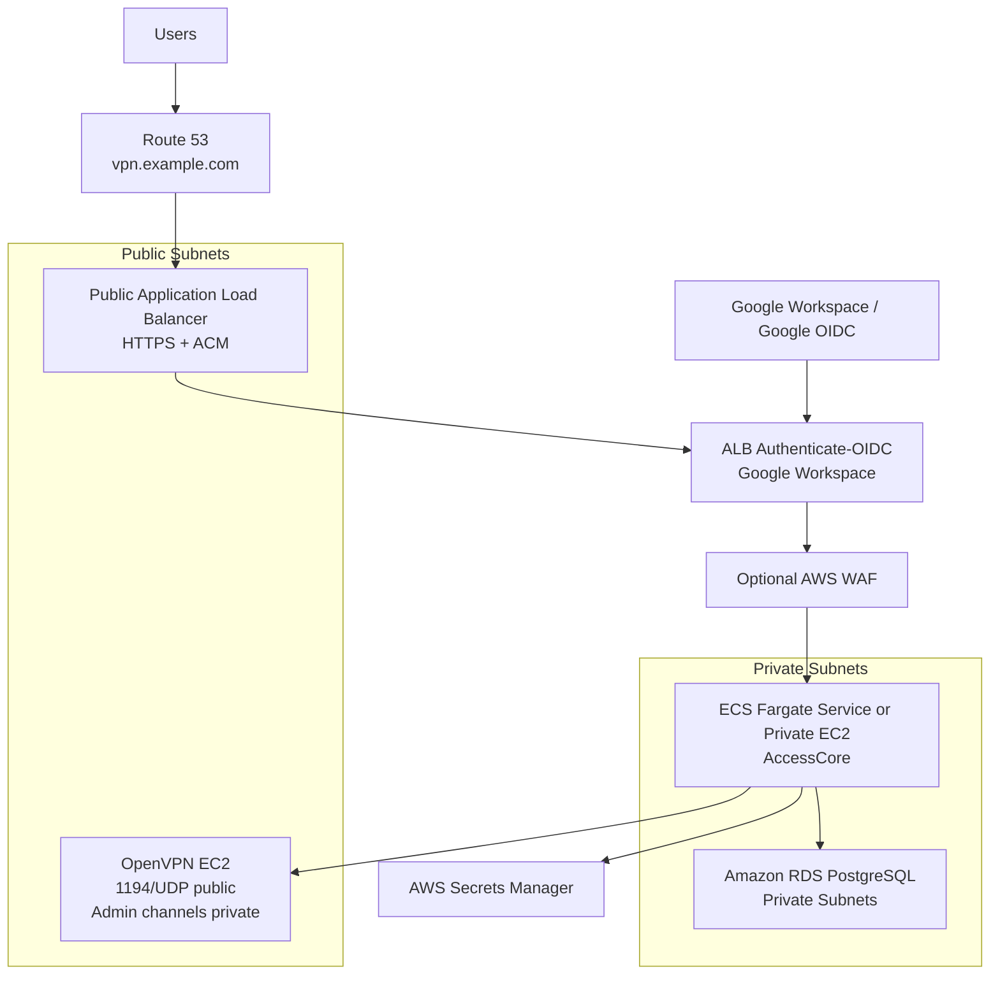

# AWS Secure Deployment with Google Workspace Access Control

This document describes a secure AWS deployment for AccessCore using:

- AWS Application Load Balancer authentication
- Google as the identity provider
- Google Workspace domain restriction
- private application and database networking

This is the AWS equivalent of putting the app behind an identity-aware access layer. It is not literal Google IAP, but it achieves the same security goal: users must authenticate with Google before they can reach the app URL.

## Architecture

## Recommended Security Model

### Public entrypoints

Only these should be public:

- `443/TCP` on the Application Load Balancer
- `1194/UDP` on the OpenVPN server

Optional:

- `80/TCP` on the ALB only for redirecting to `443`

### Private services

These should stay private:

- the app runtime itself
- PostgreSQL
- internal app services
- SSH or other administrative channels
- any management or sync backchannels

### Identity boundary

Use ALB authentication with Google OIDC so:

- unauthenticated users never reach the app
- only allowed Google accounts can pass the edge
- the app receives authenticated identity context from the ALB

## Deployment Topology

### Core AWS services

- `Route 53` for DNS
- `ACM` for TLS certificates
- `Application Load Balancer`
- `ECS Fargate` for the Next.js app
- `RDS PostgreSQL`
- `Secrets Manager`
- `CloudWatch Logs`
- `AWS WAF` recommended

### Single-EC2 starter topology

For a small single-tenant deployment, AccessCore can run on one EC2 instance with local PostgreSQL and OpenVPN, but treat this as a starter topology rather than the strongest AWS layout.

Recommended minimum controls:

- terminate HTTPS with Caddy, Nginx, ALB, or another trusted TLS proxy
- bind PostgreSQL to localhost or a private Docker network only
- expose only the portal HTTPS port and OpenVPN UDP port publicly
- keep SSH restricted to your admin IP or SSM Session Manager
- store `.env` outside the repo and set a strong `NEXTAUTH_SECRET`
- schedule encrypted PostgreSQL and OpenVPN PKI volume backups
- use the production Dockerfile and do not enable relaxed CSP flags

Do not use `docker/compose.yml` as-is for production. It is intentionally local-development friendly and includes default credentials, public Postgres mapping, SSH mapping, and relaxed CSP. For single-EC2 deployments, start from `docker/compose.prod.yml`, keep the app bound to localhost behind your TLS proxy, and keep PostgreSQL on the private compose network.

### OpenVPN placement

Run OpenVPN on EC2.

- `1194/UDP` allowed from the internet
- management access restricted to private sources only
- do not expose SSH publicly unless there is a strong operational reason

If SSH transport is still required from the app, restrict it to the app security group only.

## Google Authentication at the ALB

Configure an `authenticate-oidc` action on the ALB listener using Google as the OIDC provider.

### Authentication flow

1. User opens `https://vpn.example.com`
2. ALB redirects the user to Google for sign-in
3. Google returns the authenticated identity
4. ALB forwards the request to the app with authenticated identity headers
5. The app authorizes the user and applies in-app RBAC

### Domain restriction

Restrict access to your Google Workspace domain in two layers:

1. At the Google identity side:
   - request the `email` and `openid` scopes
   - prefer Google Workspace accounts only

2. In the app:
   - validate the authenticated email domain, for example `@yourcompany.com`
   - reject users outside the allowed domain even if they somehow reach the app

Best practice:

- allow only a Google Group or tightly controlled Workspace domain at the identity layer
- also validate the final email in the app

## Recommended App Changes for Production

For this repo, the most secure production model is:

- keep the app behind ALB auth
- trust ALB identity headers only when the request comes from the ALB path
- map the authenticated email into the app session
- keep all app RBAC and approval logic in place

### Production behavior

- edge authentication happens at the ALB
- app authorization still happens in AccessCore
- viewer/admin roles still come from the app database
- Google self-service sign-in inside the app should either:
  - be disabled in production, or
  - be kept aligned with the same allowed domain policy

### Headers to trust

The app should treat ALB-authenticated identity as the source of truth for production edge-authenticated requests.

Validate and map:

- authenticated email
- subject / user identifier
- issuer context as needed

Do not trust arbitrary client-supplied headers from the public internet.

## Network Layout

### Public subnets

- Application Load Balancer
- OpenVPN EC2

### Private subnets

- ECS app tasks
- RDS PostgreSQL

### Security groups

#### ALB security group

- allow `443` from the internet
- allow `80` only if redirect is needed

#### App security group

- allow app port only from the ALB security group
- no public ingress

#### Database security group

- allow `5432` only from the app security group

#### OpenVPN security group

- allow `1194/UDP` from the internet
- allow admin channels only from trusted private sources

## Secrets and Configuration

Store all secrets in `Secrets Manager`, not in `.env` files on deployed hosts.

At minimum:

- database connection string
- `NEXTAUTH_SECRET`
- Google OIDC client secret if needed by the ALB auth setup
- any OpenVPN integration secrets
- SSH keys or transport secrets if still used

Recommended application settings:

- production `NEXTAUTH_URL`
- strong `NEXTAUTH_SECRET`
- production database URL
- disable any development-only password auth behavior

## Logging and Monitoring

Enable:

- ALB access logs
- CloudWatch logs for app containers
- CloudTrail and AWS audit logging
- WAF logging if WAF is enabled

Watch especially for:

- repeated rejected logins
- unexpected email domains
- repeated access to protected endpoints
- unusual VPN config download or certificate activity

## Rollout Sequence

1. Provision VPC, subnets, and security groups
2. Provision RDS PostgreSQL in private subnets
3. Deploy the app to ECS Fargate in private subnets
4. Configure the public ALB with HTTPS and Google OIDC auth
5. Point DNS to the ALB
6. Restrict the app to ALB-authenticated users from the allowed domain
7. Deploy OpenVPN EC2 with only `1194/UDP` public
8. Validate login, RBAC, VPN downloads, and database connectivity

## Acceptance Checklist

- users can reach AccessCore only through the ALB
- unauthenticated users are redirected to Google
- users outside the allowed Google Workspace domain are rejected
- the app runtime is not publicly exposed
- PostgreSQL is private and reachable only from the app
- OpenVPN exposes only the required UDP port publicly
- admin/viewer access control still works inside the app

## Summary

Use AWS ALB authentication with Google OIDC as the edge security boundary, keep the application and database private, and enforce the allowed Workspace domain again inside the app. That gives you a secure, publicly reachable AccessCore URL without exposing the full stack.
