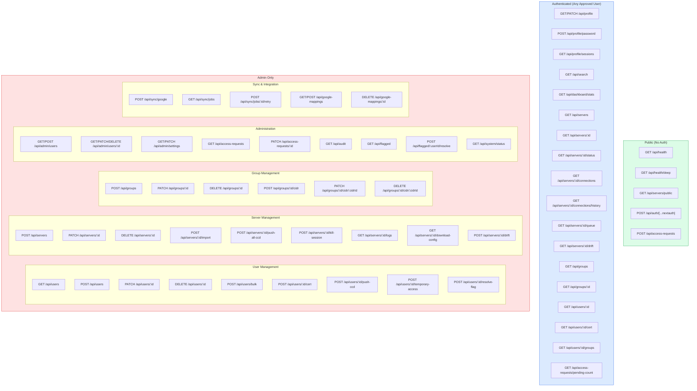
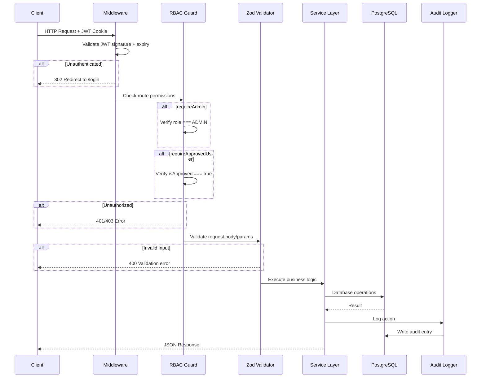

# API Routes Map

## Route Overview

```mermaid
flowchart TD
    subgraph public["Public (No Auth)"]
        health["GET /api/health"]
        healthDeep["GET /api/health/deep"]
        serversPub["GET /api/servers/public"]
        authRoute["POST /api/auth/[...nextauth]"]
        accessReqCreate["POST /api/access-requests"]
    end

    subgraph authenticated["Authenticated (Any Approved User)"]
        profile["GET/PATCH /api/profile"]
        profilePw["POST /api/profile/password"]
        profileSess["GET /api/profile/sessions"]
        search["GET /api/search"]
        dashStats["GET /api/dashboard/stats"]
        servers["GET /api/servers"]
        serverDetail["GET /api/servers/:id"]
        serverStatus["GET /api/servers/:id/status"]
        serverConn["GET /api/servers/:id/connections"]
        serverConnHist["GET /api/servers/:id/connections/history"]
        serverQueue["GET /api/servers/:id/queue"]
        serverDriftGet["GET /api/servers/:id/drift"]
        groups["GET /api/groups"]
        groupDetail["GET /api/groups/:id"]
        users["GET /api/users/:id"]
        userCert["GET /api/users/:id/cert"]
        userGroups["GET /api/users/:id/groups"]
        pendingCount["GET /api/access-requests/pending-count"]
    end

    subgraph admin["Admin Only"]
        subgraph userMgmt["User Management"]
            usersList["GET /api/users"]
            usersCreate["POST /api/users"]
            usersUpdate["PATCH /api/users/:id"]
            usersDelete["DELETE /api/users/:id"]
            usersBulk["POST /api/users/bulk"]
            certOps["POST /api/users/:id/cert"]
            pushCcd["POST /api/users/:id/push-ccd"]
            tempAccess["POST /api/users/:id/temporary-access"]
            resolveFlag["POST /api/users/:id/resolve-flag"]
        end

        subgraph serverMgmt["Server Management"]
            serversCreate["POST /api/servers"]
            serversUpdate["PATCH /api/servers/:id"]
            serversDelete["DELETE /api/servers/:id"]
            serverImport["POST /api/servers/:id/import"]
            serverPushAll["POST /api/servers/:id/push-all-ccd"]
            serverKill["POST /api/servers/:id/kill-session"]
            serverLogs["GET /api/servers/:id/logs"]
            serverConfig["GET /api/servers/:id/download-config"]
            serverDriftPost["POST /api/servers/:id/drift"]
        end

        subgraph groupMgmt["Group Management"]
            groupsCreate["POST /api/groups"]
            groupsUpdate["PATCH /api/groups/:id"]
            groupsDelete["DELETE /api/groups/:id"]
            cidrAdd["POST /api/groups/:id/cidr"]
            cidrUpdate["PATCH /api/groups/:id/cidr/:cidrId"]
            cidrDelete["DELETE /api/groups/:id/cidr/:cidrId"]
        end

        subgraph adminOps["Administration"]
            adminUsers["GET/POST /api/admin/users"]
            adminUserDetail["GET/PATCH/DELETE /api/admin/users/:id"]
            settings["GET/PATCH /api/admin/settings"]
            accessReqs["GET /api/access-requests"]
            accessReqAction["PATCH /api/access-requests/:id"]
            audit["GET /api/audit"]
            flagged["GET /api/flagged"]
            flaggedResolve["POST /api/flagged/:userId/resolve"]
            systemStatus["GET /api/system/status"]
        end

        subgraph syncOps["Sync & Integration"]
            syncGoogle["POST /api/sync/google"]
            syncJobs["GET /api/sync/jobs"]
            syncRetry["POST /api/sync/jobs/:id/retry"]
            googleMappings["GET/POST /api/google-mappings"]
            googleMappingDel["DELETE /api/google-mappings/:id"]
        end
    end

    style public fill:#dcfce7,stroke:#16a34a
    style authenticated fill:#dbeafe,stroke:#2563eb
    style admin fill:#fee2e2,stroke:#dc2626
```

## Request Processing Pipeline

```mermaid
sequenceDiagram
    participant C as Client
    participant MW as Middleware
    participant RBAC as RBAC Guard
    participant VAL as Zod Validator
    participant SVC as Service Layer
    participant DB as PostgreSQL
    participant AUD as Audit Logger

    C->>MW: HTTP Request + JWT Cookie
    MW->>MW: Validate JWT signature + expiry

    alt Unauthenticated
        MW-->>C: 302 Redirect to /login
    end

    MW->>RBAC: Check route permissions

    alt requireAdmin
        RBAC->>RBAC: Verify role === ADMIN
    end
    alt requireApprovedUser
        RBAC->>RBAC: Verify isApproved === true
    end

    alt Unauthorized
        RBAC-->>C: 401/403 Error
    end

    RBAC->>VAL: Validate request body/params

    alt Invalid input
        VAL-->>C: 400 Validation error
    end

    VAL->>SVC: Execute business logic
    SVC->>DB: Database operations
    DB-->>SVC: Result
    SVC->>AUD: Log action
    AUD->>DB: Write audit entry
    SVC-->>C: JSON Response
```
