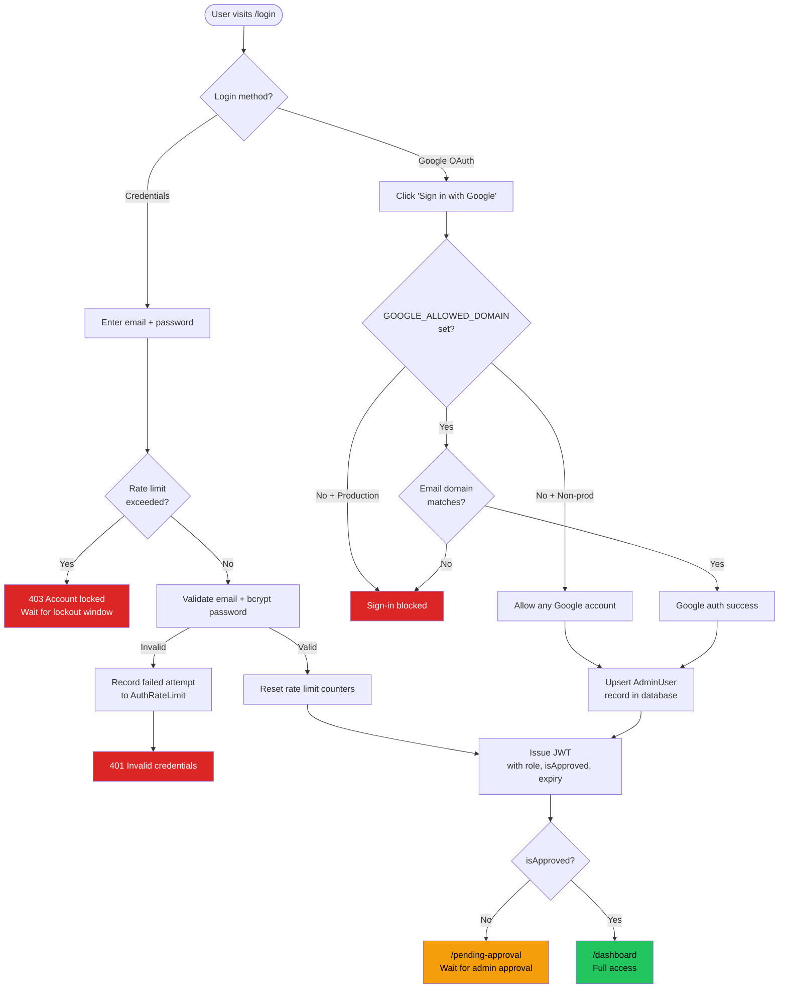
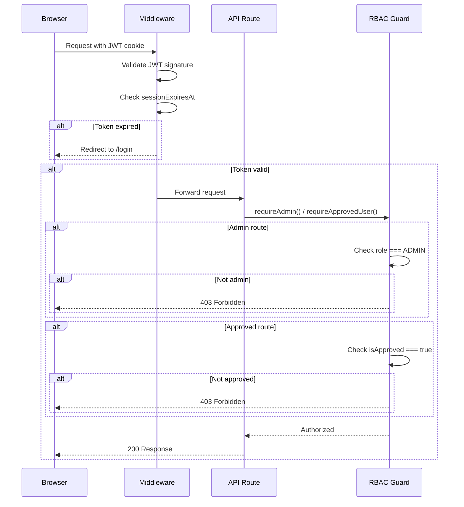
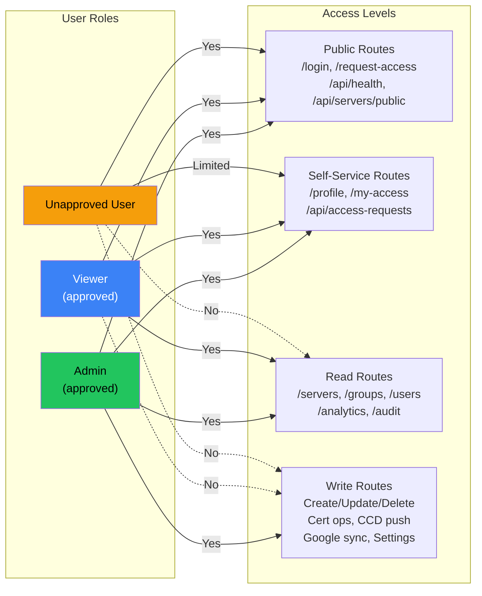

# Authentication & Authorization Flow

## Login Flow

```mermaid
flowchart TD
    start(["User visits /login"]) --> method{"Login method?"}

    method -->|"Credentials"| creds["Enter email + password"]
    method -->|"Google OAuth"| google["Click 'Sign in with Google'"]

    creds --> rateCheck{"Rate limit<br/>exceeded?"}
    rateCheck -->|"Yes"| locked["403 Account locked<br/>Wait for lockout window"]
    rateCheck -->|"No"| validateCreds["Validate email + bcrypt password"]
    validateCreds -->|"Invalid"| recordFail["Record failed attempt<br/>to AuthRateLimit"]
    recordFail --> loginFail["401 Invalid credentials"]
    validateCreds -->|"Valid"| resetRate["Reset rate limit counters"]

    google --> domainCheck{"GOOGLE_ALLOWED_DOMAIN<br/>set?"}
    domainCheck -->|"Yes"| validateDomain{"Email domain<br/>matches?"}
    domainCheck -->|"No + Production"| googleFail["Sign-in blocked"]
    domainCheck -->|"No + Non-prod"| allowAll["Allow any Google account"]
    validateDomain -->|"No"| googleFail
    validateDomain -->|"Yes"| googleOk["Google auth success"]
    allowAll --> upsertUser

    googleOk --> upsertUser["Upsert AdminUser<br/>record in database"]
    resetRate --> issueJwt

    upsertUser --> issueJwt["Issue JWT<br/>with role, isApproved, expiry"]

    issueJwt --> approved{"isApproved?"}
    approved -->|"No"| pending["/pending-approval<br/>Wait for admin approval"]
    approved -->|"Yes"| dashboard["/dashboard<br/>Full access"]

    style locked fill:#dc2626,color:#fff
    style loginFail fill:#dc2626,color:#fff
    style googleFail fill:#dc2626,color:#fff
    style pending fill:#f59e0b,color:#000
    style dashboard fill:#22c55e,color:#000
```

## Session Lifecycle

```mermaid
sequenceDiagram
    participant B as Browser
    participant M as Middleware
    participant API as API Route
    participant RBAC as RBAC Guard

    B->>M: Request with JWT cookie
    M->>M: Validate JWT signature
    M->>M: Check sessionExpiresAt

    alt Token expired
        M-->>B: Redirect to /login
    end

    alt Token valid
        M->>API: Forward request
        API->>RBAC: requireAdmin() / requireApprovedUser()

        alt Admin route
            RBAC->>RBAC: Check role === ADMIN
            alt Not admin
                RBAC-->>B: 403 Forbidden
            end
        end

        alt Approved route
            RBAC->>RBAC: Check isApproved === true
            alt Not approved
                RBAC-->>B: 403 Forbidden
            end
        end

        RBAC-->>API: Authorized
        API-->>B: 200 Response
    end
```

## Role-Based Access Control Matrix

```mermaid
flowchart LR
    subgraph roles["User Roles"]
        unapproved["Unapproved User"]
        viewer["Viewer<br/>(approved)"]
        admin["Admin<br/>(approved)"]
    end

    subgraph access["Access Levels"]
        public["Public Routes<br/>/login, /request-access<br/>/api/health, /api/servers/public"]
        self["Self-Service Routes<br/>/profile, /my-access<br/>/api/access-requests"]
        read["Read Routes<br/>/servers, /groups, /users<br/>/analytics, /audit"]
        write["Write Routes<br/>Create/Update/Delete<br/>Cert ops, CCD push<br/>Google sync, Settings"]
    end

    unapproved -->|"Yes"| public
    unapproved -->|"Limited"| self
    unapproved -.->|"No"| read
    unapproved -.->|"No"| write

    viewer -->|"Yes"| public
    viewer -->|"Yes"| self
    viewer -->|"Yes"| read
    viewer -.->|"No"| write

    admin -->|"Yes"| public
    admin -->|"Yes"| self
    admin -->|"Yes"| read
    admin -->|"Yes"| write

    style unapproved fill:#f59e0b,color:#000
    style viewer fill:#3b82f6,color:#fff
    style admin fill:#22c55e,color:#000
```
