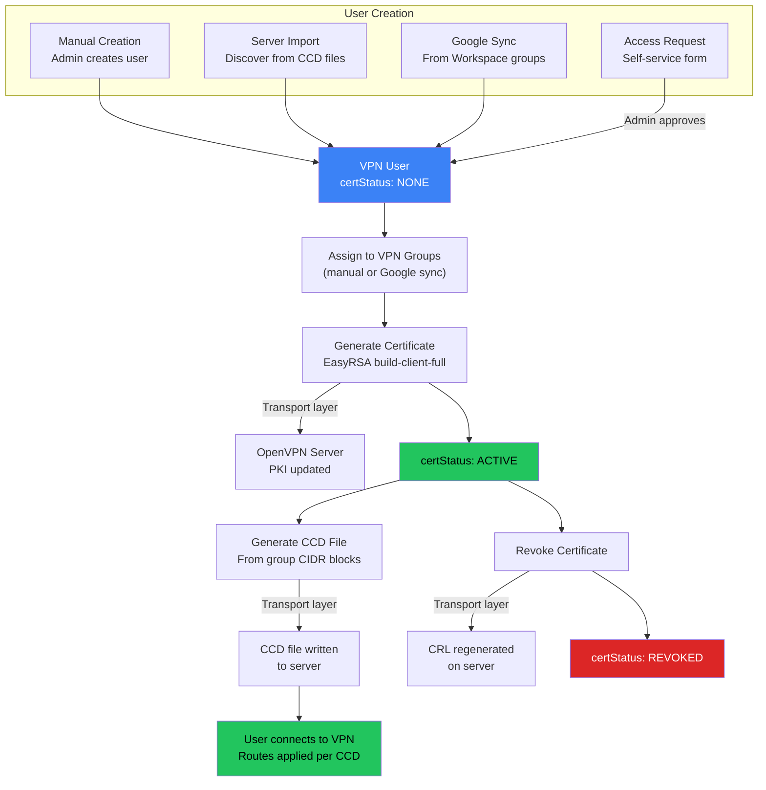
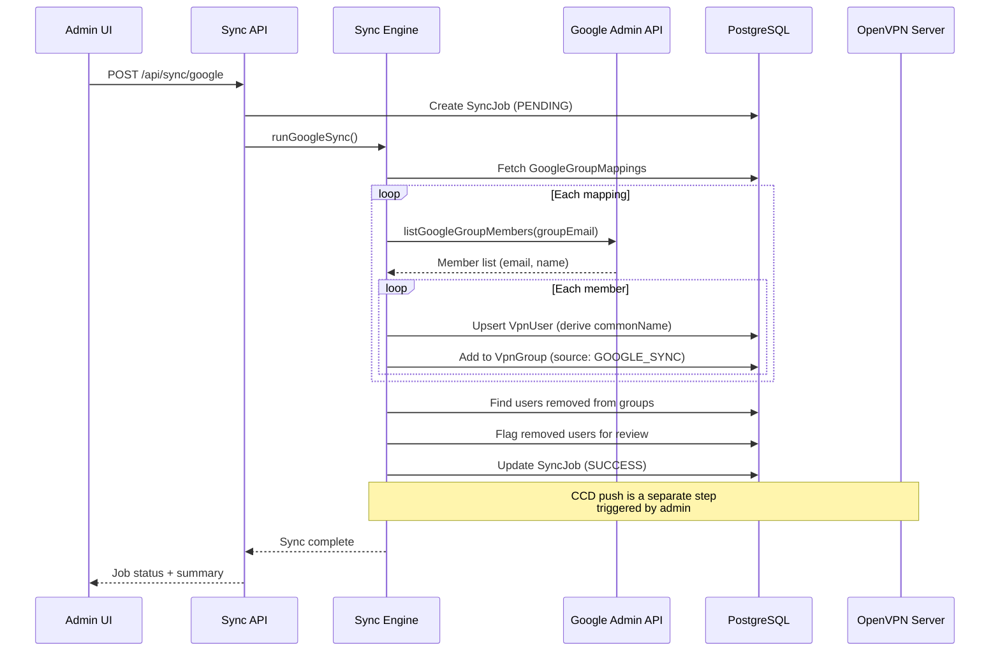
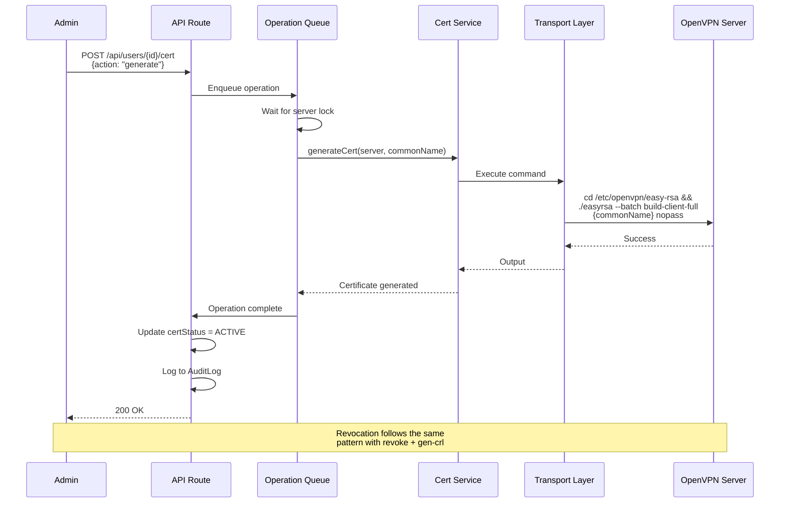
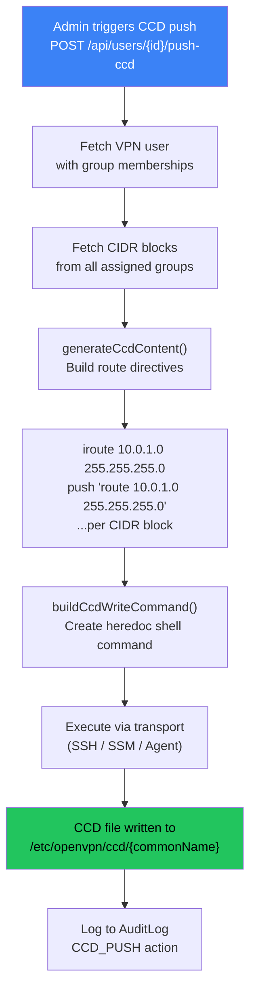

# Data Flow Diagrams

## VPN User Lifecycle

```mermaid
flowchart TD
    subgraph creation["User Creation"]
        manual["Manual Creation<br/>Admin creates user"]
        import["Server Import<br/>Discover from CCD files"]
        sync["Google Sync<br/>From Workspace groups"]
        request["Access Request<br/>Self-service form"]
    end

    manual --> user["VPN User<br/>certStatus: NONE"]
    import --> user
    sync --> user
    request -->|"Admin approves"| user

    user --> assignGroup["Assign to VPN Groups<br/>(manual or Google sync)"]
    assignGroup --> genCert["Generate Certificate<br/>EasyRSA build-client-full"]
    genCert -->|"Transport layer"| vpnServer["OpenVPN Server<br/>PKI updated"]
    genCert --> certActive["certStatus: ACTIVE"]

    certActive --> genCcd["Generate CCD File<br/>From group CIDR blocks"]
    genCcd -->|"Transport layer"| ccdFile["CCD file written<br/>to server"]

    ccdFile --> connected["User connects to VPN<br/>Routes applied per CCD"]

    certActive --> revoke["Revoke Certificate"]
    revoke -->|"Transport layer"| crl["CRL regenerated<br/>on server"]
    revoke --> certRevoked["certStatus: REVOKED"]

    style user fill:#3b82f6,color:#fff
    style certActive fill:#22c55e,color:#000
    style certRevoked fill:#dc2626,color:#fff
    style connected fill:#22c55e,color:#000
```

## Google Workspace Sync Flow

```mermaid
sequenceDiagram
    participant Admin as Admin UI
    participant API as Sync API
    participant Engine as Sync Engine
    participant Google as Google Admin API
    participant DB as PostgreSQL
    participant VPN as OpenVPN Server

    Admin->>API: POST /api/sync/google
    API->>DB: Create SyncJob (PENDING)
    API->>Engine: runGoogleSync()

    Engine->>DB: Fetch GoogleGroupMappings

    loop Each mapping
        Engine->>Google: listGoogleGroupMembers(groupEmail)
        Google-->>Engine: Member list (email, name)

        loop Each member
            Engine->>DB: Upsert VpnUser (derive commonName)
            Engine->>DB: Add to VpnGroup (source: GOOGLE_SYNC)
        end
    end

    Engine->>DB: Find users removed from groups
    Engine->>DB: Flag removed users for review
    Engine->>DB: Update SyncJob (SUCCESS)

    Note over Engine,VPN: CCD push is a separate step<br/>triggered by admin

    Engine-->>API: Sync complete
    API-->>Admin: Job status + summary
```

## Certificate Operations Flow

```mermaid
sequenceDiagram
    participant Admin as Admin
    participant API as API Route
    participant Queue as Operation Queue
    participant Cert as Cert Service
    participant Transport as Transport Layer
    participant Server as OpenVPN Server

    Admin->>API: POST /api/users/{id}/cert<br/>{action: "generate"}
    API->>Queue: Enqueue operation
    Queue->>Queue: Wait for server lock

    Queue->>Cert: generateCert(server, commonName)
    Cert->>Transport: Execute command
    Transport->>Server: cd /etc/openvpn/easy-rsa &&<br/>./easyrsa --batch build-client-full<br/>{commonName} nopass
    Server-->>Transport: Success
    Transport-->>Cert: Output
    Cert-->>Queue: Certificate generated

    Queue->>API: Operation complete
    API->>API: Update certStatus = ACTIVE
    API->>API: Log to AuditLog
    API-->>Admin: 200 OK

    Note over Admin,Server: Revocation follows the same<br/>pattern with revoke + gen-crl
```

## CCD Push Flow

```mermaid
flowchart TD
    trigger["Admin triggers CCD push<br/>POST /api/users/{id}/push-ccd"]

    trigger --> fetchUser["Fetch VPN user<br/>with group memberships"]
    fetchUser --> fetchCidrs["Fetch CIDR blocks<br/>from all assigned groups"]

    fetchCidrs --> generate["generateCcdContent()<br/>Build route directives"]
    generate --> content["iroute 10.0.1.0 255.255.255.0<br/>push 'route 10.0.1.0 255.255.255.0'<br/>...per CIDR block"]

    content --> buildCmd["buildCcdWriteCommand()<br/>Create heredoc shell command"]
    buildCmd --> transport["Execute via transport<br/>(SSH / SSM / Agent)"]
    transport --> server["CCD file written to<br/>/etc/openvpn/ccd/{commonName}"]

    server --> audit["Log to AuditLog<br/>CCD_PUSH action"]

    style trigger fill:#3b82f6,color:#fff
    style server fill:#22c55e,color:#000
```
