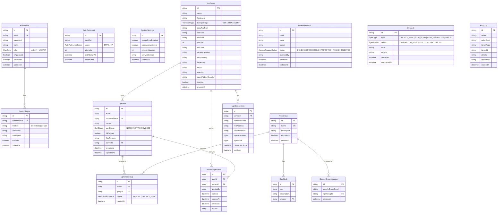

# Database Schema Diagram

## Entity Relationship Diagram

```mermaid
erDiagram
    AdminUser {
        string id PK
        string email UK
        string password
        string name
        UserRole role "ADMIN | VIEWER"
        boolean isApproved
        datetime createdAt
        datetime updatedAt
    }

    LoginHistory {
        string id PK
        string adminUserId FK
        string method "credentials | google"
        string ipAddress
        string userAgent
        boolean success
        datetime createdAt
    }

    AuthRateLimit {
        string id PK
        string identifier
        AuthRateLimitScope scope "EMAIL | IP"
        int attempts
        datetime firstAttemptAt
        datetime lockedUntil
    }

    SystemSettings {
        string id PK
        boolean googleSyncEnabled
        boolean autoApproveUsers
        int sessionMaxAge
        string allowedDomain
        datetime updatedAt
    }

    VpnServer {
        string id PK
        string name
        string hostname
        TransportType transportType "SSH | SSM | AGENT"
        string easyRsaPath
        string ccdPath
        string sshHost
        int sshPort
        string sshUser
        string sshKeySecretId
        string sshHostKey
        string instanceId
        string region
        string agentUrl
        string agentApiKeySecretId
        boolean isActive
        datetime createdAt
    }

    VpnUser {
        string id PK
        string email
        string commonName UK
        string name
        CertStatus certStatus "NONE | ACTIVE | REVOKED"
        boolean isFlagged
        string flagReason
        string serverId FK
        datetime createdAt
        datetime updatedAt
    }

    VpnGroup {
        string id PK
        string name UK
        string description
        boolean require2fa
        datetime createdAt
    }

    CidrBlock {
        string id PK
        string cidr
        string description
        string groupId FK
    }

    VpnUserGroup {
        string id PK
        string userId FK
        string groupId FK
        MembershipSource source "MANUAL | GOOGLE_SYNC"
        datetime createdAt
    }

    GoogleGroupMapping {
        string id PK
        string googleGroupEmail
        string vpnGroupId FK
        datetime createdAt
    }

    AccessRequest {
        string id PK
        string email
        string name
        string reason
        AccessRequestStatus status "PENDING | PROCESSING | APPROVED | FAILED | REJECTED"
        string reviewedBy
        datetime createdAt
        datetime updatedAt
    }

    TemporaryAccess {
        string id PK
        string userId FK
        string serverId FK
        string grantedBy
        datetime startsAt
        datetime expiresAt
        datetime revokedAt
        string reason
    }

    SyncJob {
        string id PK
        SyncType type "GOOGLE_SYNC | CCD_PUSH | CERT_OPERATION | IMPORT"
        SyncStatus status "PENDING | IN_PROGRESS | SUCCESS | FAILED"
        string error
        string details
        datetime startedAt
        datetime completedAt
    }

    VpnConnection {
        string id PK
        string serverId FK
        string commonName
        string realAddress
        string virtualAddress
        bigint bytesReceived
        bigint bytesSent
        datetime connectedSince
        datetime lastSeen
    }

    AuditLog {
        string id PK
        string action
        string actorEmail
        string targetType
        string targetId
        string details
        string ipAddress
        datetime createdAt
    }

    AdminUser ||--o{ LoginHistory : "has"
    VpnServer ||--o{ VpnUser : "hosts"
    VpnServer ||--o{ VpnConnection : "has"
    VpnServer ||--o{ TemporaryAccess : "grants"
    VpnUser ||--o{ VpnUserGroup : "belongs to"
    VpnUser ||--o{ TemporaryAccess : "receives"
    VpnGroup ||--o{ VpnUserGroup : "contains"
    VpnGroup ||--o{ CidrBlock : "has"
    VpnGroup ||--o{ GoogleGroupMapping : "mapped by"
```
