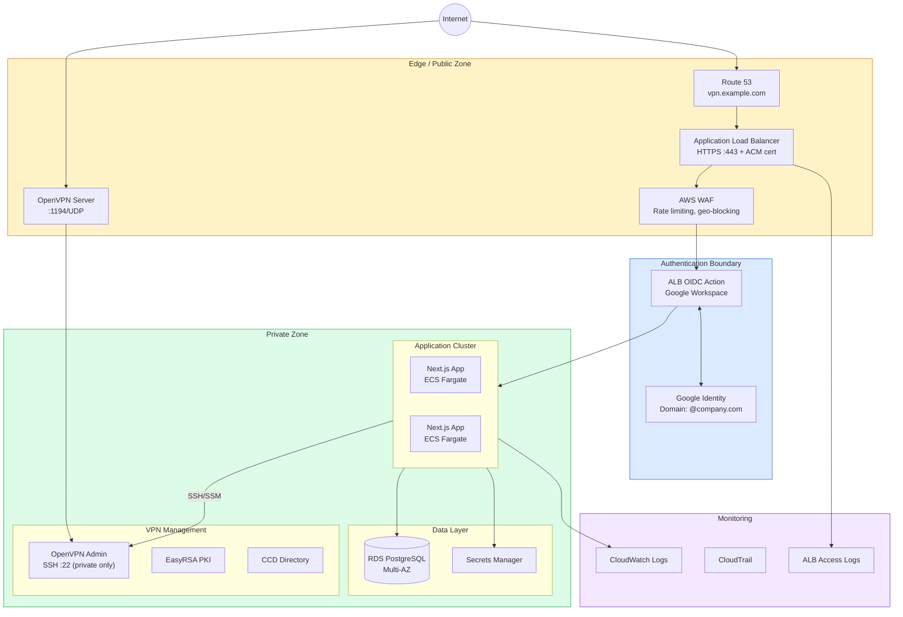
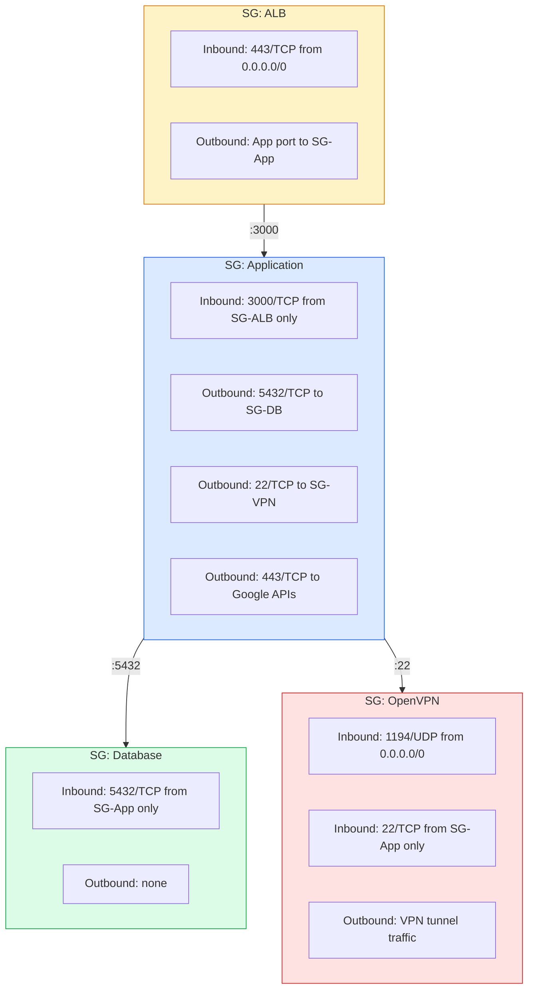
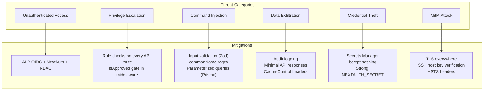

# Network & Security Architecture

## Production Network Topology

```mermaid
flowchart TB
    internet(("Internet"))

    subgraph edge["Edge / Public Zone"]
        dns["Route 53<br/>vpn.example.com"]
        alb["Application Load Balancer<br/>HTTPS :443 + ACM cert"]
        waf["AWS WAF<br/>Rate limiting, geo-blocking"]
        vpnEndpoint["OpenVPN Server<br/>:1194/UDP"]
    end

    subgraph auth["Authentication Boundary"]
        albAuth["ALB OIDC Action<br/>Google Workspace"]
        googleIdP["Google Identity<br/>Domain: @company.com"]
    end

    subgraph private["Private Zone"]
        subgraph appCluster["Application Cluster"]
            app1["Next.js App<br/>ECS Fargate"]
            app2["Next.js App<br/>ECS Fargate"]
        end

        subgraph data["Data Layer"]
            rds[("RDS PostgreSQL<br/>Multi-AZ")]
            secrets["Secrets Manager"]
        end

        subgraph vpnMgmt["VPN Management"]
            vpnAdmin["OpenVPN Admin<br/>SSH :22 (private only)"]
            easyrsa["EasyRSA PKI"]
            ccdDir["CCD Directory"]
        end
    end

    subgraph monitoring["Monitoring"]
        cw["CloudWatch Logs"]
        ct["CloudTrail"]
        albLogs["ALB Access Logs"]
    end

    internet --> dns --> alb
    alb --> waf --> albAuth
    albAuth <--> googleIdP
    albAuth --> appCluster

    internet --> vpnEndpoint
    vpnEndpoint --> vpnAdmin

    appCluster --> rds
    appCluster --> secrets
    appCluster -->|"SSH/SSM"| vpnAdmin

    appCluster --> cw
    alb --> albLogs

    style edge fill:#fef3c7,stroke:#d97706
    style private fill:#dcfce7,stroke:#16a34a
    style auth fill:#dbeafe,stroke:#2563eb
    style monitoring fill:#f3e8ff,stroke:#7c3aed
```

## Security Boundaries & Controls

```mermaid
flowchart LR
    subgraph boundary1["Boundary 1: Edge Authentication"]
        direction TB
        b1a["TLS termination at ALB"]
        b1b["Google OIDC authentication"]
        b1c["Domain restriction"]
        b1d["WAF rules"]
        b1e["HSTS enforcement"]
    end

    subgraph boundary2["Boundary 2: Application Auth"]
        direction TB
        b2a["NextAuth JWT validation"]
        b2b["Session expiry check"]
        b2c["User approval gate"]
        b2d["Rate limiting"]
        b2e["CSP headers"]
    end

    subgraph boundary3["Boundary 3: API Authorization"]
        direction TB
        b3a["RBAC middleware"]
        b3b["requireAdmin() guards"]
        b3c["requireApprovedUser() guards"]
        b3d["Input validation (Zod)"]
        b3e["Audit logging"]
    end

    subgraph boundary4["Boundary 4: Infrastructure"]
        direction TB
        b4a["Private subnets for app + DB"]
        b4b["Security groups"]
        b4c["Secrets Manager"]
        b4d["SSH key-based auth only"]
        b4e["Transport abstraction"]
    end

    boundary1 --> boundary2 --> boundary3 --> boundary4
```

## Security Group Rules

```mermaid
flowchart TD
    subgraph sgALB["SG: ALB"]
        albIn["Inbound: 443/TCP from 0.0.0.0/0"]
        albOut["Outbound: App port to SG-App"]
    end

    subgraph sgApp["SG: Application"]
        appIn["Inbound: 3000/TCP from SG-ALB only"]
        appOut1["Outbound: 5432/TCP to SG-DB"]
        appOut2["Outbound: 22/TCP to SG-VPN"]
        appOut3["Outbound: 443/TCP to Google APIs"]
    end

    subgraph sgDB["SG: Database"]
        dbIn["Inbound: 5432/TCP from SG-App only"]
        dbOut["Outbound: none"]
    end

    subgraph sgVPN["SG: OpenVPN"]
        vpnIn1["Inbound: 1194/UDP from 0.0.0.0/0"]
        vpnIn2["Inbound: 22/TCP from SG-App only"]
        vpnOut["Outbound: VPN tunnel traffic"]
    end

    sgALB -->|":3000"| sgApp
    sgApp -->|":5432"| sgDB
    sgApp -->|":22"| sgVPN

    style sgALB fill:#fef3c7,stroke:#d97706
    style sgApp fill:#dbeafe,stroke:#2563eb
    style sgDB fill:#dcfce7,stroke:#16a34a
    style sgVPN fill:#fee2e2,stroke:#dc2626
```

## Threat Model Overview

```mermaid
flowchart TD
    subgraph threats["Threat Categories"]
        t1["Unauthenticated Access"]
        t2["Privilege Escalation"]
        t3["Command Injection"]
        t4["Data Exfiltration"]
        t5["Credential Theft"]
        t6["MitM Attack"]
    end

    subgraph mitigations["Mitigations"]
        m1["ALB OIDC + NextAuth + RBAC"]
        m2["Role checks on every API route<br/>isApproved gate in middleware"]
        m3["Input validation (Zod)<br/>commonName regex<br/>Parameterized queries (Prisma)"]
        m4["Audit logging<br/>Minimal API responses<br/>Cache-Control headers"]
        m5["Secrets Manager<br/>bcrypt hashing<br/>Strong NEXTAUTH_SECRET"]
        m6["TLS everywhere<br/>SSH host key verification<br/>HSTS headers"]
    end

    t1 --> m1
    t2 --> m2
    t3 --> m3
    t4 --> m4
    t5 --> m5
    t6 --> m6
```
