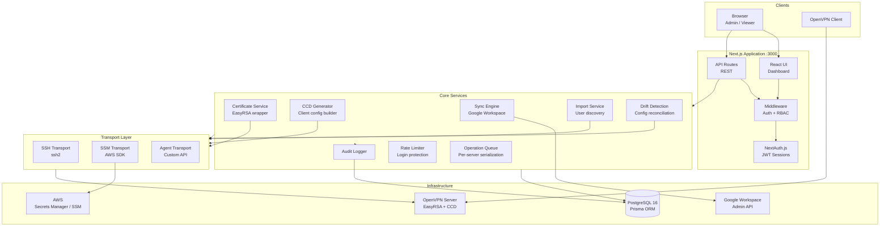

# System Architecture

## High-Level Architecture

## Component Responsibilities

| Component | Purpose |
|-----------|---------|
| **Next.js App** | Web UI and REST API, server-side rendered |
| **NextAuth.js** | JWT-based authentication (Google OAuth + credentials) |
| **Middleware** | Route protection, session validation, RBAC enforcement |
| **Certificate Service** | Generate, revoke, and check client certificates via EasyRSA |
| **CCD Generator** | Build per-client config files from group CIDR memberships |
| **Sync Engine** | Bidirectional sync between Google Workspace groups and VPN groups |
| **Import Service** | Discover and import existing users from OpenVPN server filesystem |
| **Drift Detection** | Compare database state vs. server state, flag mismatches |
| **Operation Queue** | Serialize cert/CCD operations per server to prevent conflicts |
| **Transport Layer** | Abstract server communication (SSH, AWS SSM, or custom agent) |
| **PostgreSQL** | Persistent storage for users, servers, groups, audit logs, settings |
| **OpenVPN Server** | VPN endpoint with EasyRSA PKI and CCD directory |
| **Google Workspace** | External identity and group membership source |
